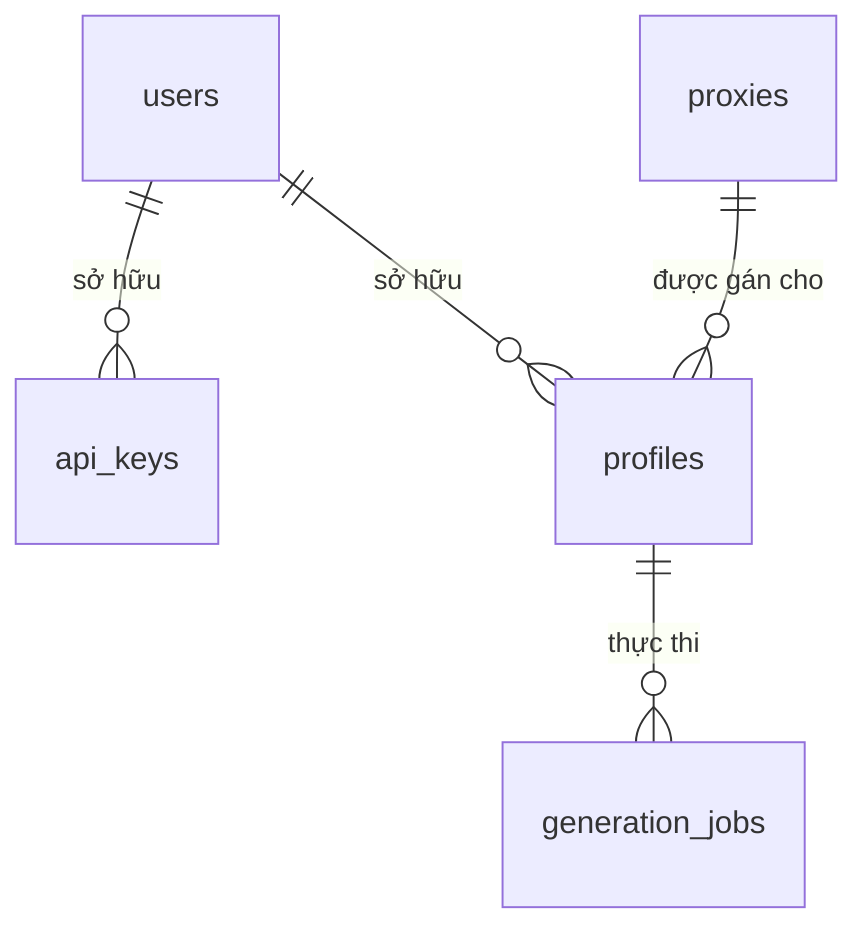

# Sơ đồ thiết kế cơ sở dữ liệu (FlowGrok)

Hệ thống sử dụng **SQLAlchemy** làm ORM, kết nối tới **SQLite** (file `flowgrok.db`). Tất cả model nằm tại `app/models/core.py`.

## 1. Bảng `users`
| Cột | Kiểu | Ghi chú |
|-----|------|---------|
| id | UUID (String) | Primary Key, auto-gen |
| email | String | Unique, Indexed |
| hashed_password | String | Mã hóa bcrypt |
| role | String | `admin` / `user` |
| is_active | Boolean | Default: true |
| created_at | DateTime | UTC |

## 2. Bảng `api_keys`
| Cột | Kiểu | Ghi chú |
|-----|------|---------|
| id | UUID (String) | Primary Key |
| user_id | UUID | FK → `users.id` |
| key | String | Unique, prefix `fgk_` |
| status | String | `active` / `revoked` |
| created_at | DateTime | UTC |

## 3. Bảng `proxies`
| Cột | Kiểu | Ghi chú |
|-----|------|---------|
| id | UUID (String) | Primary Key |
| ip | String | IP Address |
| port | Integer | Port number |
| username | String | Nullable |
| password | String | Nullable |
| status | String | `alive` / `dead` |
| created_at | DateTime | UTC |

## 4. Bảng `profiles`
| Cột | Kiểu | Ghi chú |
|-----|------|---------|
| id | UUID (String) | Primary Key |
| user_id | UUID | FK → `users.id`, Nullable |
| proxy_id | UUID | FK → `proxies.id`, Nullable |
| name | String | Tên hiển thị |
| category | String | `grok` / `flow` / `dreamina` |
| cookies_json | Text | Nội dung cookie JSON |
| antidetect_settings | JSON | UserAgent, Resolution, etc |
| status | String | `idle` / `running` / `cookie_dead` / `error` |
| created_at | DateTime | UTC |

## 5. Bảng `generation_jobs`
| Cột | Kiểu | Ghi chú |
|-----|------|---------|
| id | UUID (String) | Primary Key |
| profile_id | UUID | FK → `profiles.id` |
| prompt | Text | Nội dung yêu cầu sinh |
| category | String | `grok` / `flow` / `dreamina` |
| status | String | `pending` / `processing` / `completed` / `failed` |
| result_url | String | Link file kết quả |
| error_logs | Text | Log lỗi nếu thất bại |
| created_at | DateTime | UTC |

---

## Quan hệ giữa các bảng

